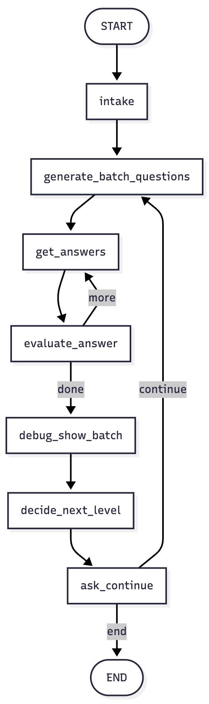

# Classmate - A LLM Based Teaching Assistant

An adaptive teaching assistant that:
- Generates a batch of questions for a chosen **subject** and **level**
- Collects user's answers, **grades** them with an LLM “judge”
- **Adapts difficulty** between batches based on the performance

## Tech stack
- **Backend:** Python, FastAPI, LangGraph, OpenAI via langchain-openai
- **Frontend:** React (Vite + TypeScript), Material UI (MUI)
- Two LLM roles: **generator** (creates questions) & **judge** (scores answers)

## Architecture
<p align="center">
  
</p>

---

## Demo (local)

- Backend: http://localhost:8000/docs  
- Frontend: http://localhost:5173/

---

## Quickstart

### Prerequisites
- Python 3.10+ and **conda** (or venv)
- Node.js 18+ and npm

### 1) Backend (FastAPI + LangGraph)

```bash
cd backend
# (Recommended) create a conda env
conda create -n ta-backend python=3.11 -y
conda activate ta-backend

# install deps
pip install -r requirements.txt

# configure secrets
cp .env.example .env
# edit .env and add your OPENAI_API_KEY

# run API
uvicorn app:app --reload --port 8000
```

Open http://localhost:8000/docs to test the API.

### 2) Frontend (React + MUI)

```bash
cd frontend
npm install
npm run dev
```

Open http://localhost:5173 to use the app. The frontend calls the backend at http://localhost:8000. Make sure the backend is running.

### Configure

Backend configuration is via ```backend/.env```:

```bash
OPENAI_API_KEY=...   # required
HOST=127.0.0.1       # optional
PORT=8000            # optional
```

### Project structure

```bash
teaching-assistant/
├─ backend/
│  ├─ app.py                 # FastAPI entry, endpoints
│  ├─ requirements.txt
│  ├─ ... LangGraph nodes (generate, evaluate, adapt)
│  └─ .env.example
├─ frontend/
│  ├─ src/
│  │  ├─ App.tsx            # main UI
│  │  ├─ api.ts             # fetch wrappers for /api
│  │  └─ ...
│  ├─ package.json
│  └─ vite.config.ts
└─ README.md
```